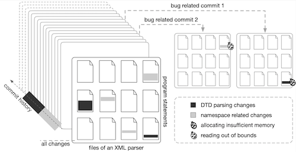

# What you change is what you fuzz!

This work is accepted by CCS 2021, entitled "Regression Greybox Fuzzing".

aflchurn is a regression greybox fuzzer that steers computing resources to code regions that are changed more recently or more frequently. aflchurn does not focus on one commit, instead, it leverages the versioning system to obtain the information of commit history, and to optimize power schedule of fuzzing. For aflchurn, each BB is a target, but with weights. BBs that are changed more recently or frequently get higher weights.

# Requirement
- We test the code on Linux 18.04, 64-bit system. 
- LLVM 
- git version 2.17.1

# This project

aflchurn is developed based on [american fuzzy lop](https://github.com/google/AFL). AFL is originally developed by Michal Zalewski <lcamtuf@google.com>. aflchurn utilizes [git](https://git-scm.com/) to obtain knowledge of changes for BBs.

## Install

Install aflchurn

    git clone https://github.com/aflchurn/aflchurn.git
    cd /path/to/aflchurn
    make clean all
    cd llvm_mode
    make clean all

## Instrument
Export environmental variables if required.
    
    CC=/path/to/aflchurn/afl-clang-fast ./configure [...options...]
    make

Be sure to also include CXX set to afl-clang-fast++ for C++ code.

## Run fuzzing

    afl-fuzz -i <input_dir> -o <out_dir> -- <file_path> [...parameters...]

# Options and Envs
## Options

| Options | args | description | note |
| :---: | :--- | :-------------------------- | :------ |
| `-p` | `anneal` | annealing-based power schedule | default |
| `-p` | `none` | vanilla AFL power schedule | / |
| `-e` | no args | disable ant colony optimisation for byte selection | / |
| `-s` | integer | scale_exponent for power schedule | / |
| `-H` | float | fitness_exponent for power schedule | / |
| `-A` | no args | "increase/decrease" mode for ACO | / |
| `-Z` | no args | alias method for seed selection | experimental |

e.g.,
If `-e` is set, it will not use the ant colony optimization for mutation.

## Envs

| Envs | values | description | note |
| :-------------------- | :--- | :--- | :---- |
| `AFLCHURN_DISABLE_AGE` |   `1`   | disable rdays | / |
| `AFLCHURN_ENABLE_RANK` | `rrank` | enable rrank and disable rdays | / |
| `AFLCHURN_DISABLE_CHURN` | `1` | disable #changes | / |
| `AFLCHURN_INST_RATIO` | integer | select N% BBs to be inserted churn/age | / |
| `AFLCHURN_SINCE_MONTHS` | integer | recording age/churn in recent N months | / |
| `AFLCHURN_CHURN_SIG` | `change` | amplify function x | experimental |
| `AFLCHURN_CHURN_SIG` |`change2`| amplify function x^2 | experimental |

e.g., `export AFLCHURN_SINCE_MONTHS=6` indicates recording changes in the recent 6 months.

